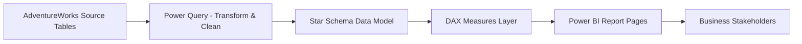
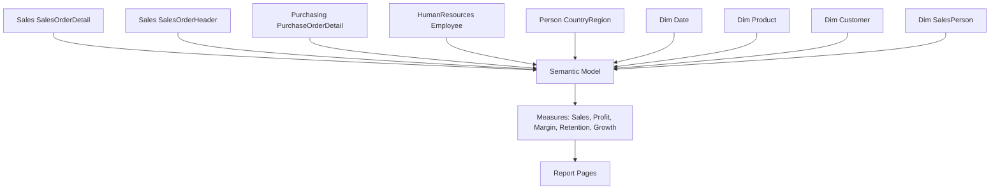
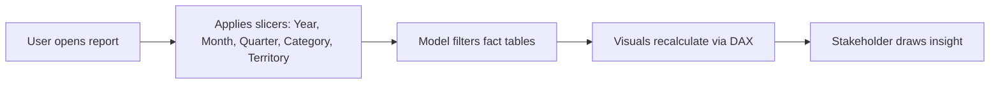
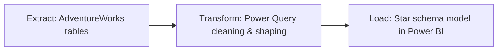
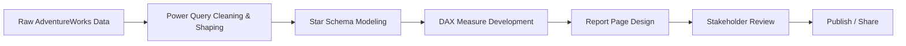

# Blinkit-Sales-Performance-Dashboard(AdventureWorks Sales & Financial Analytics Dashboard)

Enterprise-grade Power BI analytics suite covering sales performance, customer behavior, product profitability, territory expansion, financial health, and salesperson productivity for the AdventureWorks business.


<!-- TODO: Replace with an actual banner image, e.g. Report/Screenshots/banner.png -->
<p align="center"></p>

---

## Table of Contents

1. [Executive Summary](#executive-summary)
2. [Business Problem](#business-problem)
3. [Project Objectives](#project-objectives)
4. [Dashboard Preview](#dashboard-preview)
5. [Tech Stack](#tech-stack)
6. [Project Architecture](#project-architecture)
7. [Repository Structure](#repository-structure)
8. [Dataset Overview](#dataset-overview)
9. [Data Model](#data-model)
10. [SQL Analysis](#sql-analysis)
11. [Python Analysis](#python-analysis)
12. [Power BI Dashboard](#power-bi-dashboard)
13. [Key Business Insights](#key-business-insights)
14. [Business Recommendations](#business-recommendations)
15. [Key Features](#key-features)
16. [Installation](#installation)
17. [Project Workflow](#project-workflow)
18. [Future Enhancements](#future-enhancements)
19. [Skills Demonstrated](#skills-demonstrated)
20. [Contact](#contact)

---

## Executive Summary

This project delivers a multi-page Power BI analytics solution built on the AdventureWorks sales dataset. It consolidates order, customer, product, territory, and workforce data into a single semantic model and exposes it through seven purpose-built report pages, each targeting a distinct stakeholder audience — from executives tracking top-line performance to salesperson managers reviewing individual rep productivity.

The dashboard was designed to answer the recurring question every growing retail/distribution business faces: **where is revenue coming from, where is it leaking, and which levers move it fastest?** It replaces static spreadsheet reporting with an interactive, filterable, drill-down experience built on a proper star-schema data model and 70+ DAX measures.

**Business value:** faster, self-service access to sales, margin, and customer KPIs for non-technical stakeholders, with consistent definitions enforced centrally in the data model rather than recalculated ad hoc in spreadsheets.

**Expected outcome:** reduced time-to-insight for monthly business reviews, and a reusable analytics foundation that can be pointed at new data sources with minimal rework.

---

## Business Problem

Retail and distribution organizations typically track sales, margin, and customer performance across disconnected spreadsheets maintained by different teams. This creates three recurring problems:

- **Inconsistent metrics** — "Total Sales" or "Margin %" can mean different things depending on who built the spreadsheet.
- **Slow reporting cycles** — manual consolidation delays monthly and quarterly business reviews.
- **Limited drill-down** — flat reports can't answer follow-up questions (e.g., "which territory drove the YoY decline?") without a new export.

Left unaddressed, this slows decision-making, obscures underperforming products/territories, and makes it harder to react to margin erosion in real time.

## Project Objectives

- Build a single source of truth for sales, profit, and customer metrics using a star-schema semantic model.
- Track YoY and MoM performance across sales, revenue, margin, and customer acquisition.
- Surface product, territory, and salesperson performance for targeted intervention.
- Quantify discounting, return rate, and margin volatility to protect profitability.
- Provide filterable, drillable, self-service reporting so stakeholders don't need analyst support for routine questions.

---

## Dashboard Preview

<!-- TODO: Replace placeholders with actual exported screenshots (File > Export > PDF/Image in Power BI, then crop per page) -->

| Page | Preview |
|---|---|
| Executive Overview | `TODO: screenshots/executive-overview.png` |
| Product Analytics | `TODO: screenshots/product-analytics.png` |
| Customer Analytics | `TODO: screenshots/customer-analytics.png` |
| Sales Analytics | `TODO: screenshots/sales-analytics.png` |
| Territory Analytics | `TODO: screenshots/territory-analytics.png` |
| Financial Analytics | `TODO: screenshots/financial-analytics.png` |
| Salesperson Analytics | `TODO: screenshots/salesperson-analytics.png` |

---

## Tech Stack

| Category | Tools |
|---|---|
| Data Modeling | Power BI Desktop, Power Query (M) |
| Calculation Engine | DAX |
| Source Data | AdventureWorks Sales, Purchasing, HR & Person schemas |
| Analysis (optional/extendable) | SQL, Python (Pandas, NumPy, Matplotlib, Seaborn) — *TODO: confirm if SQL/Python scripts exist in this repo* |
| Notebook Environment | Jupyter Notebook — *TODO: confirm* |
| Version Control | Git, GitHub |
| File Format | `.pbix` |

> **TODO:** This README was generated directly from the `.pbix` file's report layout and data model references. If this repository also contains SQL scripts, Python notebooks, or raw CSV/Excel extracts, list them explicitly here and in the Repository Structure section.

---

## Project Architecture

### Data Flow



### Analytics Pipeline



### Dashboard Workflow



### ETL Process



---

## Repository Structure

> **TODO:** Confirm and update to match the actual repository contents. Structure below reflects a typical layout for this type of project.

```
adventureworks-analytics-dashboard/
├── README.md
├── dashboard/
│   └── adventureworks-analytics.pbix
├── screenshots/
│   ├── executive-overview.png
│   ├── product-analytics.png
│   ├── customer-analytics.png
│   ├── sales-analytics.png
│   ├── territory-analytics.png
│   ├── financial-analytics.png
│   └── salesperson-analytics.png
├── sql/                # TODO: add if SQL scripts exist
├── python/             # TODO: add if notebooks exist
└── docs/
    └── data-dictionary.md   # TODO
```

---

## Dataset Overview

| Attribute | Detail |
|---|---|
| Source | AdventureWorks (Sales, Purchasing, HumanResources, Person schemas) |
| Grain | One row per sales order line (`Sales SalesOrderDetail`) |
| Business Entities | Customers, Products, Salespersons, Territories, Orders |
| Rows / Columns | TODO — confirm from `DataModel` (not exposed in report layout) |
| Time Range | Multi-year (Year/Quarter/Month slicers present in model) |

## Data Model

The model follows a **star schema**:

**Fact Tables**
- `Sales SalesOrderDetail` — order line-level sales, profit, cost, discount, margin
- `Sales SalesOrderHeader` — order-level attributes (e.g., Order Channel)
- `Purchasing PurchaseOrderDetail` — unit price / purchasing data used in product analytics

**Dimension Tables**
- `Dim Date` — Year, Quarter, Month
- `Dim Product` — Category, Subcategory, Product Name
- `Dim Customer` — Full Name, Email, Occupation, Territory
- `Dim SalesPerson` — Full Name
- `HumanResources Employee` — Gender
- `Person CountryRegion` — Country/Region Code

**Relationships:** each dimension table connects to the fact tables via one-to-many relationships on their respective keys, enabling the ~70 DAX measures below to be sliced by date, product, customer, territory, and salesperson simultaneously.

---

## SQL Analysis

> **TODO:** No SQL scripts were found packaged alongside the `.pbix` file. If SQL was used to prepare or stage the AdventureWorks source data, add the scripts to a `/sql` folder and summarize the work here (e.g., staging views, aggregations, data quality checks).

## Python Analysis

> **TODO:** No Python/Jupyter artifacts were found packaged alongside the `.pbix` file. If exploratory data analysis, cleaning, or feature engineering was done in Python prior to loading into Power BI, add the notebooks to a `/python` folder and summarize the EDA and cleaning steps here.

---

## Power BI Dashboard

The report contains **7 pages**, each with consistent slicers (Year, Month, Quarter, Product Category, Customer Territory) for cross-page filtering consistency.

### Dashboard Pages & KPIs

| Page | Purpose | Key Cards |
|---|---|---|
| **Executive Overview** | Company-wide performance snapshot | Total Sales, Total Orders, Total Customers, Average Order Value, Profit Margin %, Total Profit |
| **Product Analytics** | Product & category performance | Total Products, Avg Price per Product, Total Categories, Return Rate %, Total Units Sold, Best Selling Product |
| **Customer Analytics** | Customer acquisition & retention | Total Customers, New Customers, Avg Revenue per Customer, Top Customer Sales, Repeat Customer Rate %, Customer Retention % |
| **Sales Analytics** | Sales trends & target tracking | Total Sales, Total Discount Given, Avg Sales per Order, Sales Growth % (MoM), Best Sales Month, Sales Target Achievement % (Pro-Rated) |
| **Territory Analytics** | Geographic performance | Total Territories, Top Performing Territory, Territory Growth %, Avg Sales per Territory, Lowest Performing Territory, International vs Domestic Split % |
| **Financial Analytics** | Profitability & cost control | Total Revenue, Total Profit, Gross Margin %, Total Cost, Net Profit Growth %, Total Units Sold |
| **Salesperson Analytics** | Rep-level productivity | Total Salespersons, Top Performer, Avg Sales per Person, Total Commission, Sales Growth per Rep %, Sales Target Achievement % (Pro-Rated) |

### Visual Types Used

Line charts, donut charts, scatter charts, bar charts, 100% stacked bar charts, waterfall charts, gauges, decomposition trees, clustered column charts, and detail tables (`tableEx`) — chosen per page to match the analytical question (trend, composition, comparison, or correlation).

### Filters (Slicers)

Applied consistently across all pages: **Year, Month, Quarter, Product Category, Customer Territory.**

### DAX Measures

70+ explicit DAX measures were built on `Sales SalesOrderDetail`, spanning:
- **Volume/scale:** Total Sales, Total Orders, Total Customers, Total Products, Total Units Sold, Total Territories, Total Salespersons
- **Profitability:** Total Profit, Gross Margin %, Profit Margin %, Actual Margin vs Target Margin, Net Profit Growth %
- **Growth (YoY/MoM):** Sales YoY %, Order YoY %, Profit YoY %, New Customers YoY %, Sales Growth % (MoM), Territory Growth %
- **Customer behavior:** New Customers, Repeat Customer Rate %, Customer Retention %, Avg Revenue per Customer, Top Customer Sales
- **Sales operations:** Total Discount Given, Return Rate %, Avg Sales per Order, Best Sales Month, Sales Target Achievement % (Pro-Rated)
- **Salesperson performance:** Top Performer, Avg Sales per Person, Total Commission, Sales Growth per Rep %

> **TODO:** Bookmarks, tooltips, and drillthrough pages were not detected in the extracted layout — confirm whether these features are configured and document them here if so.

---

## Key Business Insights

Insight callouts embedded directly in the report (Executive Overview, Sales Analytics, and Financial Analytics pages):

| Page | Insight |
|---|---|
| Executive Overview | Sales increased 22.3% compared to the prior year |
| Executive Overview | Bikes contributes the highest share of total sales by category |
| Executive Overview | United States is the top-performing territory |
| Executive Overview | Top 10 customers contribute 7.2% of total sales |
| Sales Analytics | Store channel dropped to zero in June 2014; online-only sales remained |
| Sales Analytics | Overall sales are down 60.5% versus peak, despite Bikes holding an 86% share |
| Financial Analytics | Margin collapsed to 2.8% in 2012 — the worst year on record |
| Financial Analytics | Net profit rebounded +253.8% YoY in 2013 |
| Financial Analytics | 3 of the last 4 years missed the 10% target margin |

## Business Recommendations

- **Investigate the Store channel collapse.** Sales Analytics shows the Store channel dropped to zero in June 2014 — confirm whether this reflects a genuine channel shutdown, a data pipeline gap, or a reporting artifact before acting on it.
- **Reduce category concentration risk.** With Bikes driving ~86% of revenue, evaluate cross-sell and bundling strategies for Accessories/Components to diversify the revenue base.
- **Protect margin, not just revenue.** The 2012 margin collapse (2.8%) alongside a strong 2013 rebound (+253.8% profit growth) suggests margin is more volatile than top-line sales — tie sales incentives to margin, not just volume.
- **Double down on top territories.** With United States identified as the top performer, examine what's replicable (channel mix, product mix, promotions) for underperforming territories.
- **Formalize target-tracking cadence.** Since 3 of 4 years missed the 10% target margin, review whether targets are realistic or whether cost/discounting controls need tightening.

---

## Key Features

- 7-page, stakeholder-specific Power BI report (Executive, Product, Customer, Sales, Territory, Financial, Salesperson)
- Star-schema semantic model with 9 source tables and 70+ DAX measures
- Consistent cross-page slicers for Year, Month, Quarter, Category, and Territory
- YoY and MoM growth tracking across sales, profit, customers, and salespersons
- Mix of visual types (trend, composition, correlation, comparison, target-tracking) matched to analytical intent
- Embedded narrative insight callouts on key pages

## Installation

1. Install [Power BI Desktop](https://powerbi.microsoft.com/desktop/) (Windows only).
2. Clone this repository:
   ```bash
   git clone https://github.com/TODO-your-username/TODO-repo-name.git
   ```
3. Open the `.pbix` file in Power BI Desktop:
   ```
   dashboard/adventureworks-analytics.pbix
   ```
4. If prompted, update the data source connection to point to your local/hosted AdventureWorks database.
5. Refresh the model (**Home → Refresh**) and explore the report pages via the page navigator.

## Project Workflow



## Future Enhancements

- Add SQL staging scripts and a Python EDA notebook to make the full pipeline reproducible end-to-end.
- Implement drillthrough pages (e.g., Territory → Customer detail, Product → Order detail).
- Add row-level security (RLS) for territory-based access control.
- Automate data refresh via a scheduled gateway or dataflow.
- Add forecasting (e.g., time-series projection of Total Sales) using Power BI's built-in forecasting or an external Python model.
- Publish to Power BI Service and embed a live report link in this README.

## Skills Demonstrated

**Technical:** Power BI Desktop, Power Query (M), DAX, star-schema data modeling, relationship design
**Analytical:** YoY/MoM trend analysis, cohort/retention analysis, margin and profitability analysis, target-vs-actual tracking
**Business:** KPI definition, stakeholder-specific reporting design, channel and territory performance analysis, actionable insight generation

---

## Contact

**LinkedIn:** www.linkedin.com/in/siddharaj-barad-8401aa2b8
**GitHub:** https://github.com/siddharajbarad7
**Email:** siddharajbarad9@gmail.com 

---

<p align="center"><sub>Built with Power BI · Data source: AdventureWorks</sub></p>
